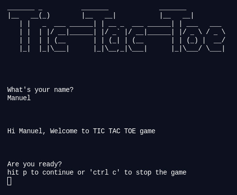

# tic_tac_toe

> In this project, the Tic Tac Toe game was built. It demonstrates main concepts of Object Oriented Programming. Particularly, classes and access to their attributes.

## PREREQUISITE

- Install at least one code editor 
- Install Ruby to execute the project

## GETTING STARTED

- clone the repository `$ git clone https://github.com/vicmaburrito/tic_tac_toe`
- open the downloaded repository with vscode.
- Run the command `$ ruby bin/main`

## Built With

- Ruby

## Rules

- 3 x 3 grid as board
- The player can choose their player icon 'X' or 'O'
- Players put their marks in numbered squares.
- First player to get 3 of her marks in a row (up, down, across, or diagonally) wins.
- 9 squares full mean the game is over. If no winner, it's a draw.

## Flow

- Player's name asked to welcome the game
- You can choose how many players
- You can choose the goal for the game score
- When you choose the number of players, ask again the name of the players to start the game
- The player can choose their player icon 'X' or 'O'
- You can select who starting first 
- Starts the game! 
- At the end of the selected games, they will say who is the winner or if it is a draw

## Live Demo

[Live Demo Link](https://repl.it/@CodeVantage/OOP#main.rb)

## Author 1

👤 **Godwin Nwachukwu**

- GitHub: [@Gnwin](https://github.com/Gnwin)
- Twitter [@gmarxr](https://twitter.com/gmarxr)
- LinkedIn: [Godwin Nwachukwu](https://www.linkedin.com/in/n-gwin/)

## Authors 2

👤 **Manuel Aldaraca**

- GitHub: [@vicmaburrito](https://github.com/vicmaburrito)
- Twitter: [@ManuelAldaraca](https://twitter.com/ManuelAldaraca)
- LinkedIn: [LinkedIn](https://www.linkedin.com/in/manuel-aldaraca/)

##  Contributing

Contributions, issues, and feature requests are welcome!

